# operationalizing-an-aws-ml-project

## Dog Image Classification

In this project, you will accomplish the following tasks:

1. Utilize SageMaker to train and deploy a model, selecting the most suitable instance types. Configure multi-instance training within your SageMaker notebook.
2. Modify your SageMaker notebooks to facilitate training and deployment on EC2 instances.
3. Establish a Lambda function associated with your deployed model. Configure auto-scaling for the deployed endpoint and manage concurrency for the Lambda function.
4. Implement proper security measures for your machine learning pipeline.

## Project Steps:
### Step 1: Training and deployment on Sagemaker

-  Created sagemaker notebook instance, I selected an ml.t3.medium instance for the notebook. This decision was based on a few key considerations:
    - The ml.t3.medium instance type is a balanced choice offering a good blend of memory, CPU, and cost efficiency. It comes with 2 virtual CPUs and 4GB of memory, making it a suitable choice for running Jupyter notebooks and conducting exploratory data analysis. This is generally sufficient for most data pre-processing tasks and developing the model before training.

    - It's worth noting that the actual model training is performed on a separate, usually more powerful instance type which is chosen based on the requirements of the specific machine learning task. This allows us to use a less compute-intensive (and less expensive) instance for the notebook without affecting the model training performance.

    - Similarly, model endpoints, which are used for making predictions in production, also run on separate instances. This setup ensures that each component of the system is running on an instance that is suited to its specific needs, providing a balance between performance and cost.

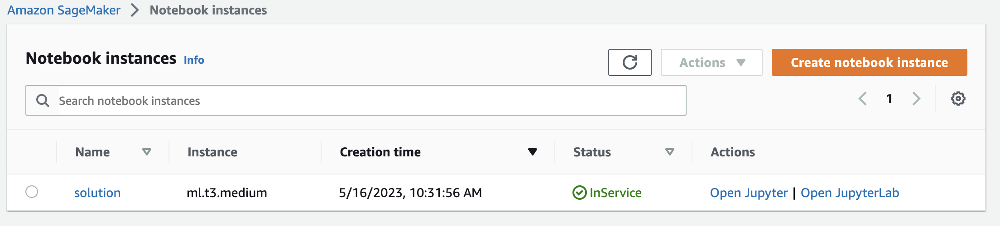

- Created S3 bucket for the job (udacitysolution-418228298154)

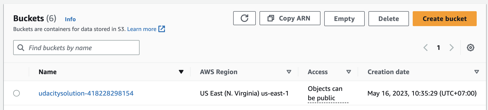

- Executed single instance training (1 epoch because of budget constraints)

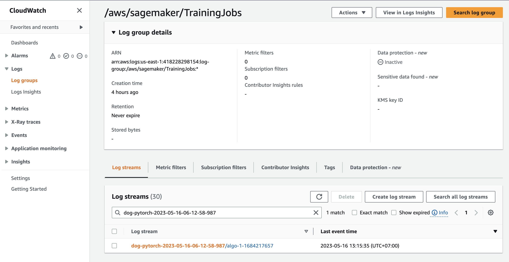

- Executed multi-instance training (4 instances, 1 epoch because of budget constraints)

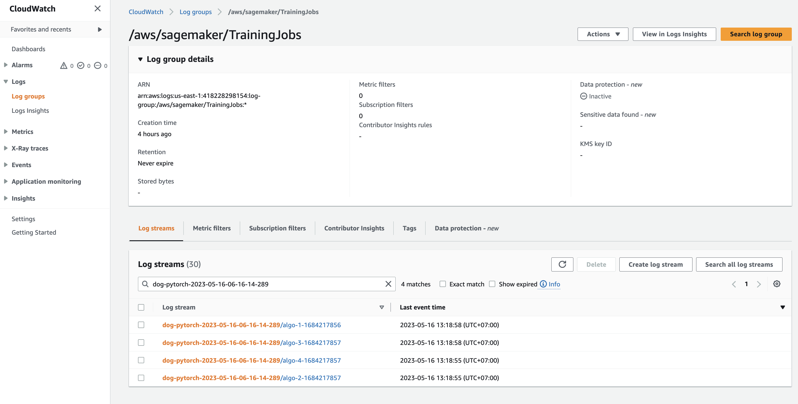

- Model deployment

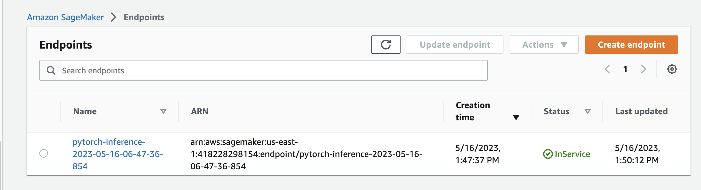

### Step 2: EC2 Training

- Model training can also be carried out on an EC2 instance. For this purpose, I opted for an Ubuntu 20.04 that already had the necessary libraries installed. I chose the `g4dn.xlarge` instance, as it comes equipped with the latest version of PyTorch. This choice was based on multiple factors including cost, computing power, launch speed, and GPU availability.

    - The g4dn.xlarge instance provides a robust balance between cost and computing power. It offers 4 vCPUs and 16GB of memory, which are more than adequate for the majority of model training tasks. Additionally, it's equipped with a powerful NVIDIA Tesla T4 GPU, which can significantly accelerate training times for deep learning models. The instance also comes pre-installed with the latest version of PyTorch, which further simplifies the setup process.

    - As for launch speed, g4dn.xlarge instances are part of the AWS Nitro System, which means they can be launched quickly and offer nearly bare-metal performance. This allows for faster iterative development and testing cycles.

- Regarding the choice of different instance types for the SageMaker model endpoints and the EC2 instance, the primary reason is that these two components serve different roles and have different requirements.

    - The ml.m5.xlarge instance used for the model endpoints is optimized for memory-intensive tasks and offers a balance of compute, memory, and network resources. This makes it a good choice for serving predictions, which typically require less compute power than training but can benefit from the additional memory for caching and other tasks.

    - On the other hand, the g4dn.xlarge instance used for the EC2 training machine is part of the GPU instance family, optimized for compute-intensive tasks and ideal for machine learning due to the presence of a powerful GPU. This makes it a more suitable choice for training complex machine learning models.

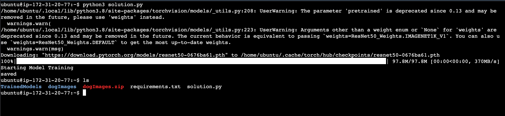


- The image above illustrates an EC2 instance executing the `ec2train1.py` script to train the model.

- The code modifications in `ec2train1.py` bear a significant resemblance to the code in `train_and_deploy-solution.ipynb`. However, there are a few distinctions due to some modules that are exclusive to SageMaker. A large portion of the EC2 training code has been modified from the functions outlined in the `hpo.py` starter script. While `ec2train.py` trains the model with specific arguments, `hpo.py` retrieves arguments for the model through command line parsing. This latter script is capable of training multiple models with varying hyperparameters.

### Step 3: Lambda function setup

- Once your model has been trained and deployed, the subsequent crucial step is to establish a Lambda function. This function facilitates the access to your model and its predictions by APIs and other applications, thereby serving as a vital component of production deployment.

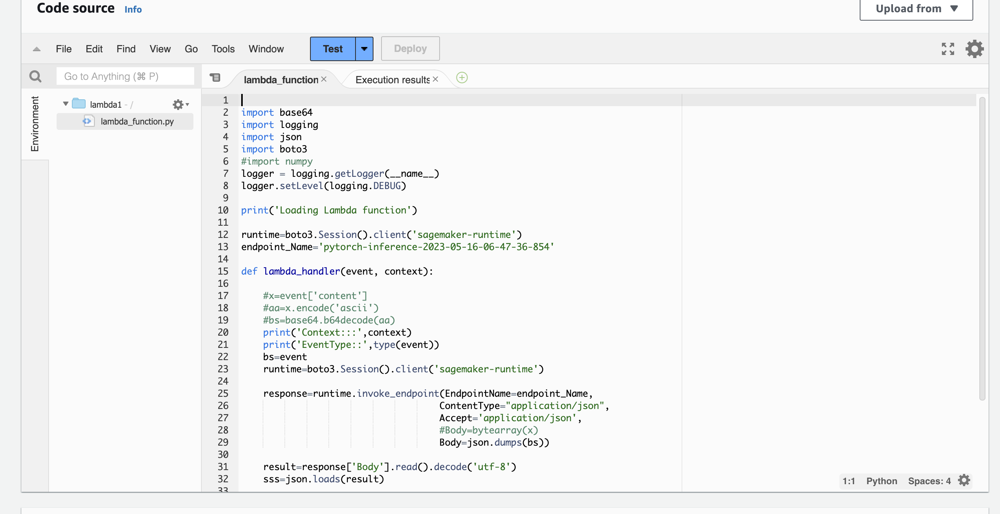

### Step 4: Lambda policy and testing

- Creating policy with permission to only invoke specific endpoint.

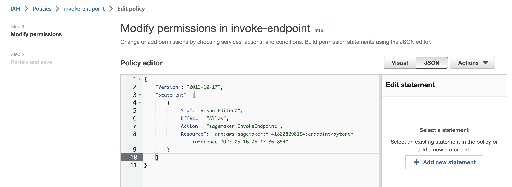

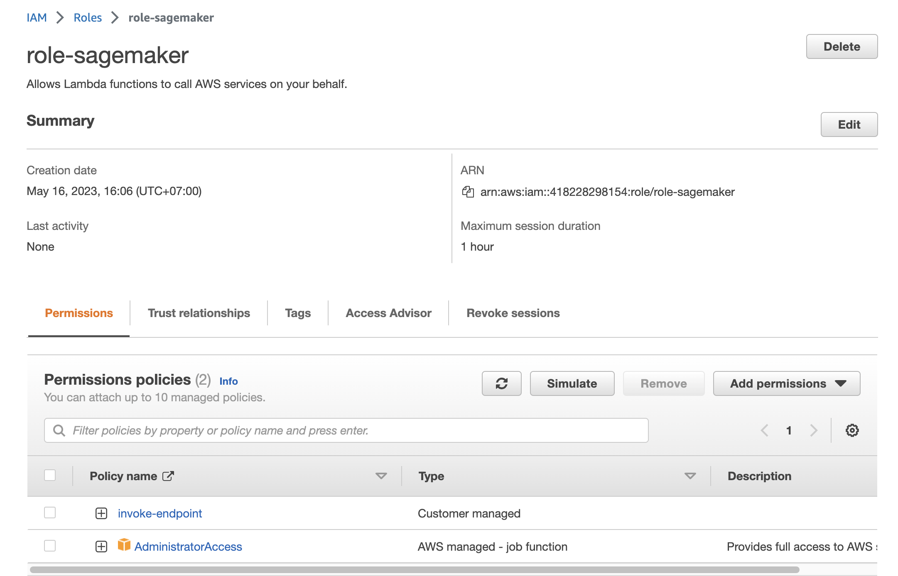

- Testing lambda function

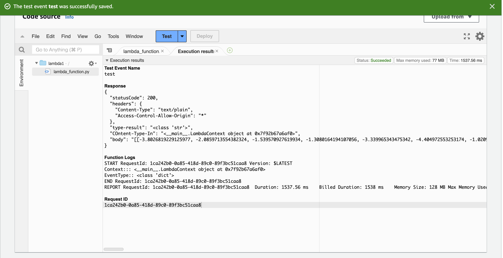

- Respone:

```
Response
{
  "statusCode": 200,
  "headers": {
    "Content-Type": "text/plain",
    "Access-Control-Allow-Origin": "*"
  },
  "type-result": "<class 'str'>",
  "COntent-Type-In": "<__main__.LambdaContext object at 0x7f92b67a6af0>",
  "body": "[[-3.8026819229125977, -2.0859713554382324, -1.539570927619934, -1.3080164194107056, -3.339965343475342, -4.404972553253174, -1.0209825038909912, -1.900415062904358, -2.956531286239624, -0.31846800446510315, -1.2855305671691895, -4.488164901733398, -1.0597424507141113, 1.0620988607406616, -3.998521566390991, -3.0901365280151367, -4.347545623779297, -2.194549560546875, -2.292271375656128, 1.4613531827926636, -2.8937950134277344, -1.1955442428588867, -4.603621482849121, -2.92773699760437, -2.6350646018981934, -3.281313180923462, -2.2812507152557373, -3.261805534362793, -2.8130531311035156, -1.1878055334091187, -0.9282594323158264, -3.1857945919036865, -4.730673789978027, -1.5436851978302002, -4.537162780761719, -2.8843417167663574, -3.3408946990966797, -2.4748477935791016, -1.0711184740066528, -2.507316827774048, -2.1006064414978027, -2.077411413192749, 1.8813728094100952, -1.3100594282150269, -2.0014002323150635, -5.724288463592529, -1.0919257402420044, -0.9209285378456116, -1.01749849319458, -0.3974989354610443, -3.730351686477661, -5.149448394775391, -4.111176490783691, -1.7322322130203247, -3.022367238998413, -1.5153255462646484, -2.9911558628082275, -3.6611413955688477, -1.9944188594818115, -2.1147618293762207, -4.525941371917725, -2.997464895248413, -4.339841842651367, -4.683041572570801, -2.261636734008789, -3.0569100379943848, -0.9021389484405518, -4.452295303344727, -2.18411922454834, -0.2539750933647156, 0.6183738112449646, -2.6141915321350098, -3.3500468730926514, -3.0878090858459473, -3.2058985233306885, -1.1343743801116943, -5.269481182098389, -1.3220785856246948, -3.5936434268951416, -2.4593327045440674, -0.47329947352409363, -3.876897096633911, 0.4124978184700012, -2.1235811710357666, -5.330963611602783, -4.047287940979004, -1.3646618127822876, -2.864323854446411, -1.7422258853912354, -1.4358495473861694, -5.686724662780762, -4.1877665519714355, -2.343993663787842, -3.5264501571655273, -2.2768118381500244, -0.4151455760002136, -0.6376075148582458, -1.7722325325012207, -3.9547088146209717, -2.759162425994873, -3.774449586868286, -1.6567118167877197, -1.488266110420227, -3.67352294921875, -3.1619045734405518, -3.5365829467773438, -2.6133177280426025, -1.365824580192566, -3.008732795715332, -0.39713871479034424, -0.5222817063331604, -0.2639937400817871, -4.13600492477417, -1.5596508979797363, -3.58133864402771, -2.406162977218628, -6.019803524017334, -0.6986405253410339, -3.070871591567993, -0.1717919111251831, 0.023802954703569412, -3.0725650787353516, -3.4439449310302734, -2.497530221939087, -3.286989450454712, -2.190408229827881, -1.2030950784683228, 0.4249667227268219, -3.0472755432128906, -4.850414752960205, -1.4908115863800049, -1.322715163230896, -2.5584988594055176]]"
}
```

### Step 5: Lambda concurrency setup and endpoint auto-scaling

- Concurrency

    - Concurrency refers to the number of simultaneous requests that an instance can handle. For example, in our setup, we have a target value of 3. This means that if there are three simultaneous requests, our instance will handle them concurrently. However, if there are more than three, SageMaker will initiate auto-scaling to create additional instances.

    ```
    reserved instances: 5/1000
    provisioned instances: 3/5
    ```

    - As for the reserved instances and provisioned instances parameters, these reflect the number of instances that we have reserved and provisioned out of the maximum limit. In our case, we have reserved 5 instances out of a limit of 1000, and provisioned 3 out of these 5. Reserving instances can provide cost savings for predictable workloads, while provisioned instances are those currently available for use.

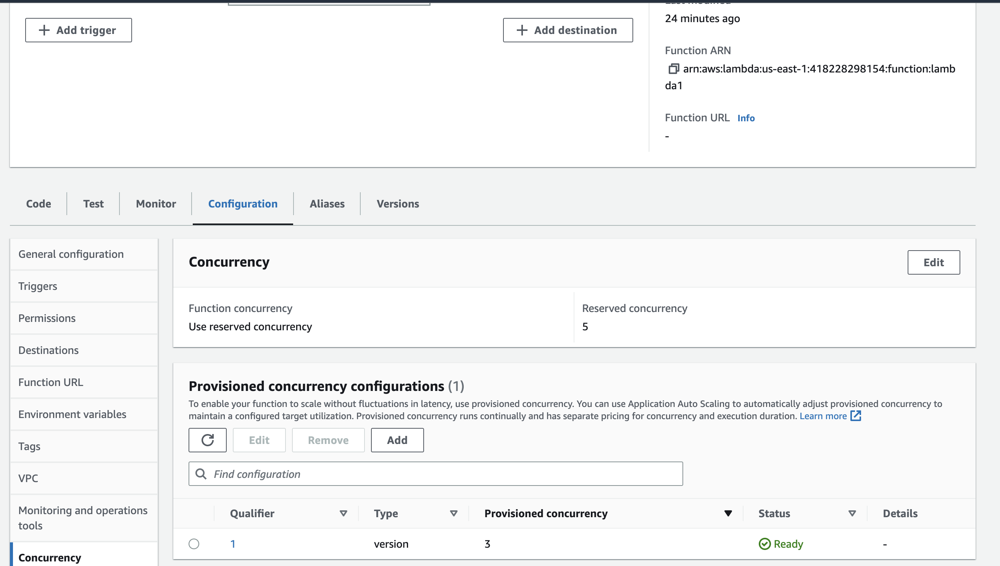

- Auto-scaling
    - Auto-scaling in SageMaker works within a predefined range of minimum and maximum instances. In our case, we set the minimum instances to 1 and the maximum instances to 3. This means that there will always be at least one instance available, and up to two additional instances can be spun up if the traffic demand increases.

    ```
    minimum instances: 1
    maximum instances: 3
    target value: 3    // number of simulataneous requests which will trigger scaling
    scale-in time: 300 s
    scale-out time: 300 s
    ```

    - The scale-in and scale-out parameters are used to determine when to add or remove instances. Scale-out time, set to 300 seconds in our case, is the period after which an additional instance will be initiated if the number of simultaneous requests consistently exceeds the target value. Conversely, scale-in time, also set to 300 seconds, is the period after which an instance will be terminated if the number of simultaneous requests consistently falls below the target value.

    - By configuring auto-scaling, we can ensure that our SageMaker endpoint can handle high traffic volumes while also keeping costs under control. When traffic is low, instances will be scaled in to save costs. When traffic increases, instances will be scaled out to maintain performance. This dynamic adjustment allows us to balance cost and performance effectively.


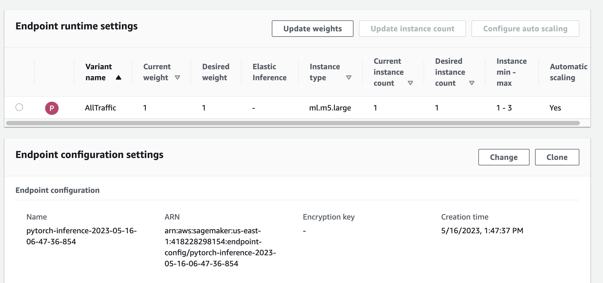