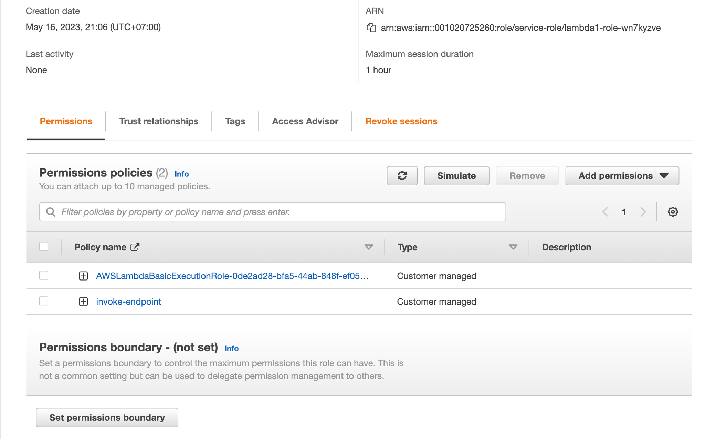

# operationalizing-an-aws-ml-project

## Dog Image Classification

In this project, you will accomplish the following tasks:

1. Utilize SageMaker to train and deploy a model, selecting the most suitable instance types. Configure multi-instance training within your SageMaker notebook.
2. Modify your SageMaker notebooks to facilitate training and deployment on EC2 instances.
3. Establish a Lambda function associated with your deployed model. Configure auto-scaling for the deployed endpoint and manage concurrency for the Lambda function.
4. Implement proper security measures for your machine learning pipeline.

## Project Steps:
### Step 1: Training and deployment on Sagemaker

- Created sagemaker notebook instance I have used ml.t3.medium as this is suffiecint to run my notebook.


- Created S3 bucket for the job (udacitysolution-418228298154)


- Executed single instance training (1 epoch because of budget constraints)


- Executed multi-instance training (4 instances, 1 epoch because of budget constraints)


- Model deployment


### Step 2: EC2 Training

- Model training can also be carried out on an EC2 instance. For this purpose, I opted for an Ubuntu 20.04 that already had the necessary libraries installed. I chose the `g4dn.xlarge` instance, as it comes equipped with the latest version of PyTorch.


- The image above illustrates an EC2 instance executing the `ec2train1.py` script to train the model.

- The code modifications in `ec2train1.py` bear a significant resemblance to the code in `train_and_deploy-solution.ipynb`. However, there are a few distinctions due to some modules that are exclusive to SageMaker. A large portion of the EC2 training code has been modified from the functions outlined in the `hpo.py` starter script. While `ec2train.py` trains the model with specific arguments, `hpo.py` retrieves arguments for the model through command line parsing. This latter script is capable of training multiple models with varying hyperparameters.

### Step 3: Lambda function setup

- Once your model has been trained and deployed, the subsequent crucial step is to establish a Lambda function. This function facilitates the access to your model and its predictions by APIs and other applications, thereby serving as a vital component of production deployment.


### Step 4: Lambda policy and testing

- Creating policy with permission to only invoke specific endpoint.




- Testing lambda function


- Respone:

```
Response
{
  "statusCode": 200,
  "headers": {
    "Content-Type": "text/plain",
    "Access-Control-Allow-Origin": "*"
  },
  "type-result": "<class 'str'>",
  "COntent-Type-In": "<__main__.LambdaContext object at 0x7f92b67a6af0>",
  "body": "[[-3.8026819229125977, -2.0859713554382324, -1.539570927619934, -1.3080164194107056, -3.339965343475342, -4.404972553253174, -1.0209825038909912, -1.900415062904358, -2.956531286239624, -0.31846800446510315, -1.2855305671691895, -4.488164901733398, -1.0597424507141113, 1.0620988607406616, -3.998521566390991, -3.0901365280151367, -4.347545623779297, -2.194549560546875, -2.292271375656128, 1.4613531827926636, -2.8937950134277344, -1.1955442428588867, -4.603621482849121, -2.92773699760437, -2.6350646018981934, -3.281313180923462, -2.2812507152557373, -3.261805534362793, -2.8130531311035156, -1.1878055334091187, -0.9282594323158264, -3.1857945919036865, -4.730673789978027, -1.5436851978302002, -4.537162780761719, -2.8843417167663574, -3.3408946990966797, -2.4748477935791016, -1.0711184740066528, -2.507316827774048, -2.1006064414978027, -2.077411413192749, 1.8813728094100952, -1.3100594282150269, -2.0014002323150635, -5.724288463592529, -1.0919257402420044, -0.9209285378456116, -1.01749849319458, -0.3974989354610443, -3.730351686477661, -5.149448394775391, -4.111176490783691, -1.7322322130203247, -3.022367238998413, -1.5153255462646484, -2.9911558628082275, -3.6611413955688477, -1.9944188594818115, -2.1147618293762207, -4.525941371917725, -2.997464895248413, -4.339841842651367, -4.683041572570801, -2.261636734008789, -3.0569100379943848, -0.9021389484405518, -4.452295303344727, -2.18411922454834, -0.2539750933647156, 0.6183738112449646, -2.6141915321350098, -3.3500468730926514, -3.0878090858459473, -3.2058985233306885, -1.1343743801116943, -5.269481182098389, -1.3220785856246948, -3.5936434268951416, -2.4593327045440674, -0.47329947352409363, -3.876897096633911, 0.4124978184700012, -2.1235811710357666, -5.330963611602783, -4.047287940979004, -1.3646618127822876, -2.864323854446411, -1.7422258853912354, -1.4358495473861694, -5.686724662780762, -4.1877665519714355, -2.343993663787842, -3.5264501571655273, -2.2768118381500244, -0.4151455760002136, -0.6376075148582458, -1.7722325325012207, -3.9547088146209717, -2.759162425994873, -3.774449586868286, -1.6567118167877197, -1.488266110420227, -3.67352294921875, -3.1619045734405518, -3.5365829467773438, -2.6133177280426025, -1.365824580192566, -3.008732795715332, -0.39713871479034424, -0.5222817063331604, -0.2639937400817871, -4.13600492477417, -1.5596508979797363, -3.58133864402771, -2.406162977218628, -6.019803524017334, -0.6986405253410339, -3.070871591567993, -0.1717919111251831, 0.023802954703569412, -3.0725650787353516, -3.4439449310302734, -2.497530221939087, -3.286989450454712, -2.190408229827881, -1.2030950784683228, 0.4249667227268219, -3.0472755432128906, -4.850414752960205, -1.4908115863800049, -1.322715163230896, -2.5584988594055176]]"
}
```

### Step 5: Lambda concurrency setup and endpoint auto-scaling

- Concurrency

```
reserved instances: 5/1000
provisioned instances: 3/5
```


- Auto-scaling

Sagemaker endpoints require automatic scaling to respond to high traffic. 

```
minimum instances: 1
maximum instances: 3
target value: 3    // number of simulataneous requests which will trigger scaling
scale-in time: 300 s
scale-out time: 300 s
```


